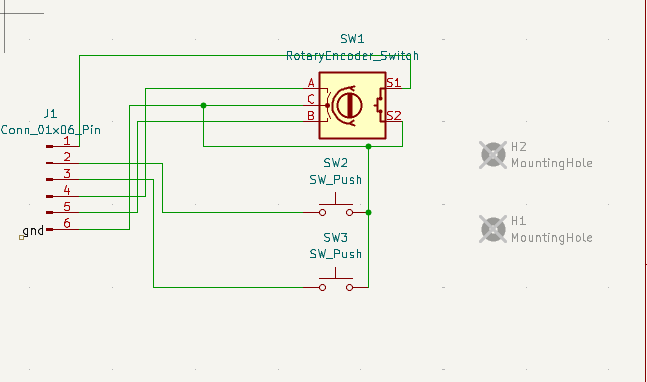
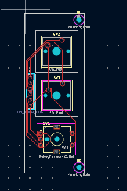
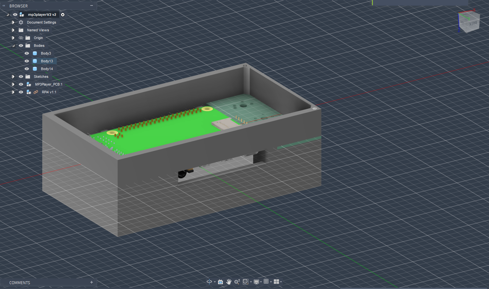

19 hours 55 minutes

# Day 1(June 5)

the basic idea is a retro ipod (like) mp3 player with a FTP server for uploading
i used a waveshare 240\*320 display.
my first decision was what kind of gui to use. SInce i could setup the display as the Pi's, i briefly considered using something like Electron (ewww) / EGui (Rust :crab:) / cTK (Python)
However. all of these wpould prevent headless execution, lowering battery life. Additionally, keyboard support is requierd, as we plan to have physical buttons. I then thought of huhh (Golang), which could be run from a TTY, but decided against it due to image support and other stuff
So, i'm making my own custom GUI using their library (ig i have to make an audio visualizer with that :( )
i will also bundle it with nvlc or musikcube or ncmpcpp (pls dont hurt me) 
**3 hours spent**

# Day 2(June 6)

Mostly just code refactors, segmenting things into functions. I setup Image drawing for album art aswell as the down button (crazy).
The media screen template was created - im using vlc python bindings to play the media properly. The song class has to be expanded to contain more information  
 
i may just have to make the media async to ensure that i can update the Media GUI parallely
 
**1.5 hour spent**

# Day 3(June 9)

more work on the music player to handle buttons 
**45 minutes spent**

# Day 4(June 10)

Updated time readings according to WakaTime. Buttons were updated to get rid of that awful version i had before and actually  
register them on startup. More utility functions were added for changing the status of the media as well as volume. I finally got the PCB pinout, so i was able to setup all the functions. IMO refining is all that's left  
 
**1.2 hours spent**

# Day 5(June 12)

Finally worked on/finished the PCB for this, which has two mechanical keys and encoder 
Also made the case for the mp3player 
**7(yikes) hours spent**

# Day 6 (June 13th)

Slightly redesigned the PCB, as earlier it was more of a 'reverse-hat' wherein I had a 40 pin header directly going onto the pi's pins but thats kinda problematic with mounting 
 
What i've done now is just put a simple 6 pin female header to just connect with wires to the GPIO. I'm currently redesigning the case right now to accomodate this so will update soon 

**4 hours spent**

# Day 7 (June 14th)

Made a case for it today, fully covering the pi end to end. 

**1.5 hours spent**
